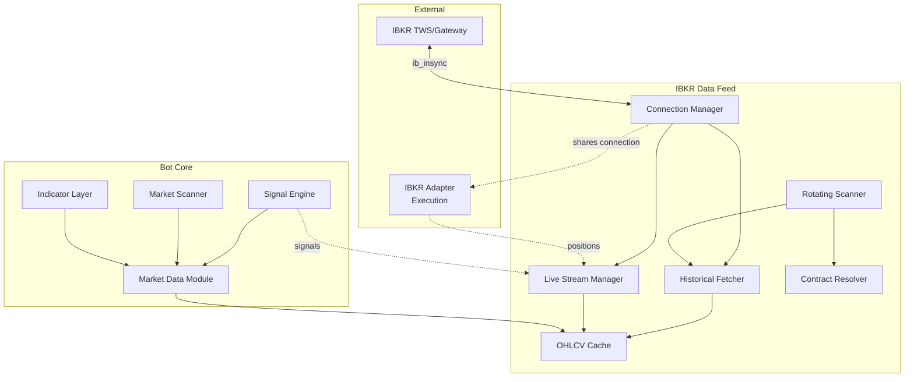

# Design Document: IBKR Rotating Data Feed

## Overview

This design implements a professional hedge-fund style rotating batch architecture for Interactive Brokers market data integration. The system addresses IBKR's ~100 active ticker subscription limit by implementing a batched historical data approach with selective live streaming.

The architecture consists of three primary data flow patterns:

1. **Rotating Historical Fetch**: Cycles through the asset universe in batches (20-50 symbols), fetching recent OHLCV candles via `reqHistoricalData` and caching them locally
2. **Selective Live Streaming**: Maintains `reqMktData` subscriptions only for assets with active positions or recent signals (max 80 concurrent)
3. **Cache-First Retrieval**: Serves indicator calculations from local OHLCV cache, triggering background refreshes when data becomes stale

This approach enables monitoring of 500+ symbols while staying within IBKR API limits, with sub-second response times for cached data and real-time updates for active positions.

### Key Design Decisions

**Why Rotating Batches Instead of Persistent Streams?**
- IBKR limits market data subscriptions to ~100 concurrent tickers
- Most assets only need periodic updates (every 5-15 minutes) for signal generation
- Historical data fetching (`reqHistoricalData`) has higher rate limits than live subscriptions
- Batched approach scales to thousands of symbols without hitting subscription limits

**Why Separate Historical and Live Components?**
- Different API rate limits and error handling requirements
- Live streams require immediate processing; historical fetches can be queued
- Allows prioritization: active positions get live data, passive monitoring uses batched historical

**Why Local Cache Instead of Database?**
- Sub-millisecond read latency for indicator calculations
- Reduces database I/O for high-frequency candle updates
- Simplifies deployment (no additional database schema)
- Cache persistence to disk provides restart resilience

## Architecture

### Component Diagram



### Data Flow Patterns

**Pattern 1: Rotating Historical Fetch (Passive Monitoring)**
```
Rotating Scanner → Contract Resolver → Historical Fetcher → IBKR API
                                                              ↓
                                                         OHLCV Cache
                                                              ↓
                                                      Indicator Layer
```

**Pattern 2: Live Stream (Active Positions)**
```
Signal Engine → Live Stream Manager → IBKR reqMktData
                                           ↓
                                      Tick Updates
                                           ↓
                                      OHLCV Cache (update current candle)
                                           ↓
                                   Risk Manager (stop loss checks)
```

**Pattern 3: Cache-First Retrieval**
```
Indicator Request → Market Data Module → OHLCV Cache
                                              ↓
                                         Cache Hit? → Return DataFrame
                                              ↓
                                         Cache Miss → Trigger Historical Fetch
                                                           ↓
                                                      Return Stale/Empty
                                                           ↓
                                                   Background Refresh → Cache
```

## Components and Interfaces

### 1. IBKRMarketDataClient

Main facade coordinating all IBKR market data operations.

**Responsibilities:**
- Lifecycle management (startup, shutdown, reconnection)
- Configuration loading and validation
- Coordination between Historical Fetcher, Live Stream Manager, and Rotating Scanner
- Integration with existing market_data module interface

**Interface:**
```python
class IBKRMarketDataClient:
    def __init__(self, config: IBKRConfig):
        """Initialize with configuration."""
        
    async def connect(self) -> bool:
        """Establish IBKR connection and start background tasks."""
        
    async def disconnect(self):
        """Gracefully shutdown all components."""
        
    def get_latest_candles(
        self, 
        symbol: str, 
        timeframe: str, 
        count: int = 200
    ) -> pd.DataFrame:
        """Retrieve cached OHLCV data (cache-first)."""
        
    async def get_historical_ohlcv(
        self,
        symbol: str,
        timeframe: str,
        start: datetime,
        end: datetime
    ) -> pd.DataFrame:
        """Fetch historical data (may trigger background fetch)."""
        
    def subscribe_live(self, symbol: str, reason: str):
        """Request live stream for symbol (position/signal)."""
        
    def unsubscribe_live(self, symbol: str):
        """Remove live stream subscription."""
        
    def get_health_status(self) -> dict:
        """Return connection state, metrics, cache stats."""
        
    def get_metrics(self) -> dict:
        """Return performance metrics."""
```

### 2. ConnectionManager

Manages IBKR socket connection lifecycle with automatic reconnection.

**Responsibilities:**
- Establish and maintain ib_insync IB connection
- Exponential backoff reconnection (max 5 attempts)
- Restore subscriptions after reconnection
- Share connection with IBKRAdapter (execution layer)
- Connection state monitoring and logging

**Interface:**
```python
class ConnectionManager:
    def __init__(self, host: str, port: int, client_id: int):
        """Initialize connection parameters."""
        
    async def connect(self) -> bool:
        """Connect to IBKR TWS/Gateway."""
        
    async def reconnect(self) -> bool:
        """Attempt reconnection with exponential backoff."""
        
    def is_connected(self) -> bool:
        """Check current connection state."""
        
    def get_ib_instance(self) -> IB:
        """Return shared ib_insync IB instance."""
        
    def register_disconnect_handler(self, callback: Callable):
        """Register callback for disconnect events."""
```

**Connection Sharing Strategy:**
- Use same `client_id` as IBKRAdapter if execution is read-only during data fetch
- Use `client_id + 1` if concurrent execution and data operations occur
- Coordinate via shared ConnectionManager instance passed to both components

### 3. ContractResolver

Resolves canonical symbols to IBKR Contract objects.

**Responsibilities:**
- Map canonical symbols (BTCUSD, EURUSD, AAPL) to ib_insync Contract objects
- Support Stock, Forex, Crypto, Future contract types
- Cache resolved contracts to avoid repeated API calls
- Handle contract resolution failures gracefully

**Interface:**
```python
class ContractResolver:
    def __init__(self, ib: IB):
        """Initialize with ib_insync IB instance."""
        
    async def resolve(self, symbol: str) -> Optional[Contract]:
        """Resolve canonical symbol to IBKR Contract."""
        
    def get_contract_details(self, symbol: str) -> dict:
        """Return cached contract metadata."""
        
    def clear_cache(self):
        """Clear contract resolution cache."""
```

**Resolution Logic:**
```python
def _resolve_contract(symbol: str, asset_class: str) -> Contract:
    if asset_class == "forex":
        # EURUSD → Forex('EURUSD')
        return Forex(pair=symbol)
    
    elif asset_class == "crypto":
        # BTCUSD → Crypto('BTC', 'PAXOS', 'USD')
        base = symbol.replace("USD", "").replace("USDT", "")
        return Crypto(base, 'PAXOS', 'USD')
    
    elif asset_class == "stock":
        # AAPL → Stock('AAPL', 'SMART', 'USD')
        return Stock(symbol, 'SMART', 'USD')
    
    elif asset_class == "commodity":
        # XAUUSD → Forex('XAUUSD') or specific CFD contract
        return Forex(pair=symbol)
    
    else:
        raise ValueError(f"Unsupported asset class: {asset_class}")
```

### 4. HistoricalFetcher

Fetches historical OHLCV data via IBKR `reqHistoricalData` API.

**Responsibilities:**
- Execute `reqHistoricalData` requests asynchronously
- Rate limit compliance (60 requests per 10 minutes, 1 second between requests)
- Queue requests and retry with backoff on errors
- Normalize IBKR bar data to standard OHLCV format
- Validate data quality before caching

**Interface:**
```python
class HistoricalFetcher:
    def __init__(
        self, 
        ib: IB, 
        contract_resolver: ContractResolver,
        rate_limiter: RateLimiter
    ):
        """Initialize with dependencies."""
        
    async def fetch(
        self,
        symbol: str,
        timeframe: str,
        count: int = 200
    ) -> pd.DataFrame:
        """Fetch recent N candles for symbol-timeframe."""
        
    async def fetch_range(
        self,
        symbol: str,
        timeframe: str,
        start: datetime,
        end: datetime
    ) -> pd.DataFrame:
        """Fetch candles for specific date range."""
        
    async def fetch_batch(
        self,
        symbols: List[str],
        timeframe: str,
        count: int = 200
    ) -> Dict[str, pd.DataFrame]:
        """Fetch data for multiple symbols concurrently."""
```

**IBKR Timeframe Mapping:**
```python
IBKR_DURATION_MAP = {
    "1m":  ("1800 S", "1 min"),   # 30 minutes of 1-min bars
    "5m":  ("1 D", "5 mins"),      # 1 day of 5-min bars
    "15m": ("3 D", "15 mins"),     # 3 days of 15-min bars
    "30m": ("1 W", "30 mins"),     # 1 week of 30-min bars
    "1h":  ("1 M", "1 hour"),      # 1 month of 1-hour bars
    "4h":  ("3 M", "4 hours"),     # 3 months of 4-hour bars
    "1d":  ("1 Y", "1 day"),       # 1 year of daily bars
}
```

### 5. LiveStreamManager

Manages selective `reqMktData` subscriptions for active positions and signals.

**Responsibilities:**
- Subscribe/unsubscribe to live market data streams
- Enforce 80 concurrent subscription limit
- Age-based eviction when limit reached
- Update OHLCV cache with live tick data
- Track subscription reasons (position, signal, manual)

**Interface:**
```python
class LiveStreamManager:
    def __init__(
        self, 
        ib: IB,
        contract_resolver: ContractResolver,
        cache: OHLCVCache,
        max_subscriptions: int = 80
    ):
        """Initialize with dependencies."""
        
    async def subscribe(
        self, 
        symbol: str, 
        reason: str = "signal"
    ) -> bool:
        """Add live subscription for symbol."""
        
    async def unsubscribe(self, symbol: str) -> bool:
        """Remove live subscription."""
        
    def get_active_subscriptions(self) -> List[dict]:
        """Return list of active subscriptions with metadata."""
        
    def _on_tick(self, ticker: Ticker):
        """Handle incoming tick data (internal callback)."""
        
    def _evict_oldest_non_position(self):
        """Remove oldest subscription not tied to position."""
```

**Subscription Priority:**
1. **Position** (highest): Asset has open trade
2. **Signal**: Asset has recent valid signal
3. **Manual**: Explicitly requested subscription
4. **Scanner**: High-priority scanner candidate

**Eviction Logic:**
- When subscription limit reached and new subscription needed
- Sort subscriptions by (priority, age)
- Evict lowest priority, oldest subscription
- Never evict position-related subscriptions

### 6. OHLCVCache

In-memory cache for recent OHLCV candle data with disk persistence.

**Responsibilities:**
- Store recent candles per symbol-timeframe pair (200+ candles)
- Thread-safe read/write access
- Append new candles and prune old data
- Update current candle with live tick data
- Serialize to disk on shutdown, load on startup

**Interface:**
```python
class OHLCVCache:
    def __init__(self, retention_hours: int = 24):
        """Initialize cache with retention policy."""
        
    def get(
        self, 
        symbol: str, 
        timeframe: str, 
        count: int = 200
    ) -> pd.DataFrame:
        """Retrieve cached candles (returns empty if not found)."""
        
    def update(
        self,
        symbol: str,
        timeframe: str,
        df: pd.DataFrame
    ):
        """Append new candles to cache."""
        
    def update_current_candle(
        self,
        symbol: str,
        timeframe: str,
        price: float,
        volume: float,
        timestamp: datetime
    ):
        """Update most recent candle with live tick data."""
        
    def get_cache_stats(self) -> dict:
        """Return cache statistics (symbols, candles, memory)."""
        
    async def persist(self, directory: Path):
        """Save cache to disk (parquet files)."""
        
    async def load(self, directory: Path):
        """Load cache from disk."""
```

**Data Structure:**
```python
# Internal storage: Dict[Tuple[symbol, timeframe], pd.DataFrame]
_cache: Dict[Tuple[str, str], pd.DataFrame] = {}

# Each DataFrame has columns: time, open, high, low, close, volume
# Sorted by time, no duplicate timestamps
# Max 200-500 candles per symbol-timeframe pair
```

### 7. RotatingScanner

Cycles through asset universe in batches, fetching historical data.

**Responsibilities:**
- Divide asset universe into batches (20-50 symbols)
- Rotate through batches sequentially
- Skip symbols with active live streams
- Prioritize symbols with recent signals or positions
- Coordinate with HistoricalFetcher for batch requests

**Interface:**
```python
class RotatingScanner:
    def __init__(
        self,
        historical_fetcher: HistoricalFetcher,
        cache: OHLCVCache,
        live_stream_manager: LiveStreamManager,
        config: ScannerConfig
    ):
        """Initialize with dependencies and config."""
        
    async def start(self):
        """Begin rotation loop (runs until stopped)."""
        
    async def stop(self):
        """Stop rotation loop gracefully."""
        
    def set_asset_universe(self, symbols: List[str]):
        """Update list of symbols to monitor."""
        
    def set_priority(self, symbol: str, priority: int):
        """Adjust symbol priority for scan frequency."""
        
    def get_rotation_status(self) -> dict:
        """Return current batch, progress, cycle time."""
```

**Rotation Algorithm:**
```python
async def _rotation_loop(self):
    while self._running:
        # 1. Build batches with priority weighting
        batches = self._build_priority_batches()
        
        # 2. Process each batch
        for batch in batches:
            # Filter out symbols with live streams
            symbols_to_fetch = [
                s for s in batch 
                if not self.live_stream_manager.is_subscribed(s)
            ]
            
            # 3. Fetch historical data for batch
            results = await self.historical_fetcher.fetch_batch(
                symbols_to_fetch,
                self.timeframe,
                count=200
            )
            
            # 4. Update cache
            for symbol, df in results.items():
                self.cache.update(symbol, self.timeframe, df)
            
            # 5. Wait before next batch
            await asyncio.sleep(self.config.rotation_delay_seconds)
        
        # 6. Log cycle completion
        logger.info(f"Rotation cycle complete: {len(batches)} batches")
```

### 8. RateLimiter

Enforces IBKR API rate limits to prevent pacing violations.

**Responsibilities:**
- Track request counts per time window
- Enforce minimum delays between requests
- Queue requests when approaching limits
- Pause on pacing violation errors

**Interface:**
```python
class RateLimiter:
    def __init__(
        self,
        requests_per_10min: int = 60,
        min_delay_seconds: float = 1.0
    ):
        """Initialize rate limit parameters."""
        
    async def acquire(self, request_type: str = "historical"):
        """Wait until request can proceed within rate limits."""
        
    def record_request(self, request_type: str):
        """Record completed request for rate tracking."""
        
    def record_pacing_violation(self):
        """Trigger 60-second pause on pacing error."""
        
    def get_stats(self) -> dict:
        """Return current rate limit statistics."""
```

## Data Models

### IBKRConfig

Configuration for IBKR market data client.

```python
@dataclass
class IBKRConfig:
    # Connection
    host: str = "127.0.0.1"
    port: int = 7497
    client_id: int = 2  # Different from execution adapter
    
    # Rotating Scanner
    batch_size: int = 30
    rotation_delay_seconds: int = 10
    rotation_cycle_minutes: int = 10
    
    # Live Streaming
    max_live_subscriptions: int = 80
    
    # Historical Fetching
    historical_candle_count: int = 200
    
    # Cache
    cache_retention_hours: int = 24
    cache_persist_path: Path = Path("data/historical")
    
    # Rate Limiting
    rate_limit_requests_per_10min: int = 60
    min_request_delay_seconds: float = 1.0
    
    # Reconnection
    reconnect_max_attempts: int = 5
    reconnect_backoff_base: float = 2.0
    
    # Timeframes
    supported_timeframes: List[str] = field(
        default_factory=lambda: ["1m", "5m", "15m", "30m", "1h", "4h", "1d"]
    )
    
    @classmethod
    def from_env(cls) -> "IBKRConfig":
        """Load configuration from environment variables."""
        return cls(
            host=os.getenv("IBKR_HOST", "127.0.0.1"),
            port=int(os.getenv("IBKR_PORT", "7497")),
            client_id=int(os.getenv("IBKR_DATA_CLIENT_ID", "2")),
            batch_size=int(os.getenv("IBKR_BATCH_SIZE", "30")),
            # ... load other config values
        )
```

### CacheKey

Unique identifier for cached OHLCV data.

```python
@dataclass(frozen=True)
class CacheKey:
    symbol: str
    timeframe: str
    
    def __str__(self) -> str:
        return f"{self.symbol}_{self.timeframe}"
    
    def to_filename(self) -> str:
        """Generate parquet filename for persistence."""
        return f"{self.symbol}_{self.timeframe}_ibkr.parquet"
```

### SubscriptionInfo

Metadata for live market data subscription.

```python
@dataclass
class SubscriptionInfo:
    symbol: str
    reason: str  # "position", "signal", "manual", "scanner"
    subscribed_at: datetime
    ticker: Optional[Ticker] = None
    last_update: Optional[datetime] = None
    
    @property
    def priority(self) -> int:
        """Return priority score for eviction logic."""
        priority_map = {
            "position": 100,
            "signal": 50,
            "manual": 25,
            "scanner": 10
        }
        return priority_map.get(self.reason, 0)
    
    @property
    def age_seconds(self) -> float:
        """Return subscription age in seconds."""
        return (datetime.now(timezone.utc) - self.subscribed_at).total_seconds()
```

### HealthStatus

System health and status information.

```python
@dataclass
class HealthStatus:
    is_connected: bool
    connection_state: str  # "connected", "disconnected", "reconnecting"
    last_successful_fetch: Optional[datetime]
    active_live_streams: int
    cached_symbols: int
    cached_candles: int
    current_batch_index: int
    rotation_cycle_count: int
    failed_requests_last_hour: int
    error_rate_percent: float
    
    @property
    def is_healthy(self) -> bool:
        """Overall health check."""
        return (
            self.is_connected and
            self.error_rate_percent < 10.0 and
            self.last_successful_fetch is not None and
            (datetime.now(timezone.utc) - self.last_successful_fetch).total_seconds() < 300
        )
    
    @property
    def status_level(self) -> str:
        """Return 'healthy', 'degraded', or 'unhealthy'."""
        if not self.is_connected:
            return "unhealthy"
        if self.error_rate_percent > 10.0:
            return "degraded"
        return "healthy"
```

### PerformanceMetrics

Performance tracking metrics.

```python
@dataclass
class PerformanceMetrics:
    # Request metrics
    total_requests: int = 0
    failed_requests: int = 0
    successful_requests: int = 0
    
    # Timing metrics
    average_response_time_ms: float = 0.0
    p95_response_time_ms: float = 0.0
    
    # Cache metrics
    cache_hits: int = 0
    cache_misses: int = 0
    cache_hit_rate: float = 0.0
    
    # Rotation metrics
    batches_per_hour: float = 0.0
    symbols_per_minute: float = 0.0
    full_rotation_time_seconds: float = 0.0
    
    # Subscription metrics
    subscription_changes_per_hour: float = 0.0
    active_subscriptions: int = 0
    
    # Rate limit metrics
    rate_limit_delays: int = 0
    pacing_violations: int = 0
    
    def reset_hourly_counters(self):
        """Reset rate-based counters (called every hour)."""
        self.batches_per_hour = 0.0
        self.subscription_changes_per_hour = 0.0
        self.rate_limit_delays = 0
```


## Correctness Properties

*A property is a characteristic or behavior that should hold true across all valid executions of a system—essentially, a formal statement about what the system should do. Properties serve as the bridge between human-readable specifications and machine-verifiable correctness guarantees.*

### Property 1: Reconnection Exponential Backoff

*For any* connection loss event, the Connection_Manager should attempt exactly 5 reconnection attempts with exponentially increasing delays between attempts.

**Validates: Requirements 1.2**

### Property 2: Subscription Restoration After Reconnection

*For any* set of active subscriptions, when a disconnection occurs followed by successful reconnection, all previously active subscriptions should be restored.

**Validates: Requirements 1.3**

### Property 3: Connection State Logging

*For any* connection state change (connected, disconnected, reconnecting), a log entry with timestamp should be created.

**Validates: Requirements 1.4**

### Property 4: Historical Fetch Candle Count Bounds

*For any* historical data fetch request, the number of candles requested should be between 50 and 200 inclusive.

**Validates: Requirements 2.2**

### Property 5: Rate Limit Queuing

*For any* rate limit error from IBKR, the Historical_Fetcher should queue the failed request and retry with appropriate delay rather than dropping it.

**Validates: Requirements 2.5**

### Property 6: Historical Data Normalization

*For any* historical data received from IBKR, the normalized output should be a DataFrame with columns [time, open, high, low, close, volume] where time is UTC timezone-aware.

**Validates: Requirements 2.7, 6.5, 6.6**

### Property 7: Cache Retention Capacity

*For any* symbol-timeframe pair in the cache, when fully populated, the cache should maintain at least 200 candles.

**Validates: Requirements 3.2**

### Property 8: Cache Pruning on Update

*For any* cache update with new candles, candles older than the retention window should be removed while preserving all candles within the retention window.

**Validates: Requirements 3.3**

### Property 9: Thread-Safe Cache Access

*For any* concurrent read operations on the cache, all reads should complete successfully without data corruption or race conditions.

**Validates: Requirements 3.4**

### Property 10: Cache DataFrame Format

*For any* cache retrieval operation, the returned DataFrame should have exactly the columns [time, open, high, low, close, volume] in that order.

**Validates: Requirements 3.6, 6.5**

### Property 11: Batch Size Constraints

*For any* asset universe divided into batches, each batch should contain between 20 and 50 symbols inclusive.

**Validates: Requirements 4.1**

### Property 12: Sequential Batch Processing

*For any* rotation cycle, batches should be processed sequentially without overlap, meaning batch N+1 should not start until batch N completes.

**Validates: Requirements 4.2**

### Property 13: Complete Batch Coverage

*For any* batch being processed, historical data should be fetched for all symbols in that batch (excluding those with active live streams).

**Validates: Requirements 4.3**

### Property 14: Batch Delay Compliance

*For any* completed batch, the delay before starting the next batch should be within the configured range (5 to 30 seconds).

**Validates: Requirements 4.4**

### Property 15: Rotation Cycle Time

*For any* complete rotation through all batches, the total cycle time should be within the configured limit (5 to 15 minutes).

**Validates: Requirements 4.5**

### Property 16: Live Stream Exclusion

*For any* batch being processed, no symbol with an active live stream subscription should be included in the historical fetch requests.

**Validates: Requirements 4.6**

### Property 17: Rotation Loop Continuity

*For any* rotation cycle, after processing the final batch, the next batch processed should be the first batch (continuous rotation).

**Validates: Requirements 4.7**

### Property 18: Signal-Triggered Subscription

*For any* valid trading signal generated for an asset, a live market data subscription should be created for that symbol.

**Validates: Requirements 5.1**

### Property 19: Position-Triggered Subscription

*For any* trade opened for an asset, a live market data subscription should exist for that symbol.

**Validates: Requirements 5.2**

### Property 20: Subscription Cleanup

*For any* trade closed on an asset, if no other active signals exist for that asset, the live market data subscription should be removed.

**Validates: Requirements 5.3**

### Property 21: Subscription Limit Invariant

*For any* point in time during system operation, the number of active live subscriptions should not exceed 80.

**Validates: Requirements 5.4**

### Property 22: Eviction Priority

*For any* situation where subscription limit is reached and a new subscription is required, the evicted subscription should be the oldest non-position subscription (lowest priority, oldest age).

**Validates: Requirements 5.5**

### Property 23: Tick Cache Update

*For any* live tick received, the OHLCV_Cache should be updated with the latest price information for that symbol's current candle.

**Validates: Requirements 5.6**

### Property 24: Cache-First Data Retrieval

*For any* indicator request for candle data, if the data exists in cache and is not stale, the cached data should be returned without triggering a network fetch.

**Validates: Requirements 6.3**

### Property 25: OHLCV Candle Validity

*For any* candle in cached or returned OHLCV data, the following invariants should hold: high >= low, high >= open, high >= close, low <= open, low <= close, and all prices > 0.

**Validates: Requirements 12.1, 12.2, 12.3, 12.5**

### Property 26: Invalid Candle Exclusion

*For any* candle that fails validation, it should be logged and excluded from the cache, and should not appear in any returned DataFrames.

**Validates: Requirements 12.4**

### Property 27: Future Timestamp Rejection

*For any* candle received, if its timestamp is in the future (beyond current time + 1 minute tolerance), it should be rejected and not cached.

**Validates: Requirements 12.6**

### Property 28: Duplicate Timestamp Deduplication

*For any* set of candles with duplicate timestamps for the same symbol-timeframe, only the most recently received candle should be retained in the cache.

**Validates: Requirements 12.7**

### Property 29: Cache Filename Convention

*For any* persisted cache file, the filename should match the pattern `{symbol}_{timeframe}_ibkr.parquet`.

**Validates: Requirements 18.3**

### Property 30: Stale Data Pruning on Load

*For any* cache loaded from disk, candles with timestamps older than 7 days should be discarded.

**Validates: Requirements 18.4**

### Property 31: Current Candle Tick Updates

*For any* live tick received for a symbol, the current candle should be updated such that: close = tick price, high = max(current high, tick price), low = min(current low, tick price), and volume += tick volume.

**Validates: Requirements 19.1, 19.2, 19.3, 19.4, 19.6**

### Property 32: Cache Round-Trip Preservation

*For any* valid OHLCV DataFrame, storing it in the cache and then retrieving it should return data equivalent to the original (same shape, columns, and values within floating-point tolerance).

**Validates: Requirements 25.6**


## Error Handling

### Connection Errors

**Scenario**: IBKR TWS/Gateway is unreachable or connection drops

**Handling**:
1. Log error with severity ERROR including error code and message
2. Trigger ConnectionManager reconnection logic with exponential backoff
3. After 5 failed attempts, enter degraded mode and notify operator
4. In degraded mode, periodically attempt reconnection every 60 seconds
5. Mark health status as "unhealthy" until connection restored

**Recovery**:
- On successful reconnection, restore all active subscriptions
- Resume rotating scanner from last completed batch
- Log recovery at INFO level with downtime duration

### Rate Limit Violations

**Scenario**: IBKR returns pacing violation error (error code 162)

**Handling**:
1. Log warning with affected request details
2. Pause all historical data requests for 60 seconds
3. Queue the failed request for retry after pause
4. Increment pacing_violations metric
5. If violations exceed 3 per hour, reduce batch size by 20%

**Recovery**:
- Resume requests after pause period
- Gradually restore batch size if no violations for 1 hour

### Contract Resolution Failures

**Scenario**: Symbol cannot be resolved to IBKR Contract

**Handling**:
1. Log error with symbol and asset class
2. Skip symbol in current rotation batch
3. Add symbol to failed_contracts list
4. Retry resolution on next rotation cycle (may be temporary IBKR issue)
5. After 3 consecutive failures, remove symbol from asset universe

**Recovery**:
- If resolution succeeds on retry, remove from failed_contracts list
- Log successful resolution at INFO level

### Data Validation Failures

**Scenario**: Received OHLCV data fails validation (invalid prices, timestamps, etc.)

**Handling**:
1. Log warning with symbol, timeframe, and specific validation failure
2. Exclude invalid candles from cache
3. If >50% of candles in a response are invalid, log ERROR and skip entire response
4. Increment failed_requests metric
5. Continue processing other symbols in batch

**Recovery**:
- Retry fetch on next rotation cycle
- If persistent, may indicate data quality issue with specific symbol

### Cache Persistence Errors

**Scenario**: Cannot write cache to disk or read corrupted cache file

**Handling**:
1. Log error with file path and exception details
2. For write errors: continue operation with in-memory cache only
3. For read errors: skip corrupted file and start with empty cache for that symbol
4. Create error report file in logs directory with details

**Recovery**:
- Retry persistence on next shutdown
- Corrupted files are ignored; fresh data will be fetched

### Subscription Limit Exceeded

**Scenario**: Attempt to create subscription when already at 80 limit

**Handling**:
1. Log warning with requested symbol and current subscription count
2. Trigger eviction logic to remove oldest non-position subscription
3. If all subscriptions are position-related, log ERROR and reject new subscription
4. Notify operator if position subscriptions exceed 80 (configuration issue)

**Recovery**:
- Evicted subscriptions will be recreated on next rotation if still needed
- Position subscriptions are never evicted

### Async Operation Timeouts

**Scenario**: Historical data request or subscription operation times out (>30 seconds)

**Handling**:
1. Cancel the async operation
2. Log timeout error with symbol and operation type
3. Increment failed_requests metric
4. Queue request for retry with exponential backoff (1s, 2s, 4s, 8s, 16s max)
5. After 5 timeouts for same symbol, mark symbol as problematic

**Recovery**:
- Retry with backoff
- If persistent, may indicate IBKR server issue or symbol delisting

### Memory Pressure

**Scenario**: Cache size exceeds memory limits (>1GB)

**Handling**:
1. Log warning with current cache size and symbol count
2. Reduce retention window from 24h to 12h
3. Trigger aggressive pruning of old candles
4. Reduce batch size to slow cache growth
5. If still exceeding limits, remove least-recently-used symbols

**Recovery**:
- Monitor memory usage every 5 minutes
- Gradually restore retention window if memory stabilizes

## Testing Strategy

### Unit Testing

Unit tests focus on specific components and edge cases:

**ConnectionManager Tests**:
- Test successful connection establishment
- Test reconnection with exponential backoff timing
- Test subscription restoration after reconnection
- Test degraded mode entry after max retries
- Test connection state logging

**ContractResolver Tests**:
- Test contract resolution for each asset class (Stock, Forex, Crypto, Future)
- Test caching of resolved contracts
- Test handling of invalid symbols
- Test contract details retrieval

**OHLCVCache Tests**:
- Test cache storage and retrieval for single symbol-timeframe
- Test cache pruning with retention window
- Test empty DataFrame return for missing keys
- Test persistence to parquet files
- Test loading from disk with stale data pruning
- Test handling of corrupted cache files

**RateLimiter Tests**:
- Test request delay enforcement
- Test 10-minute window tracking
- Test pacing violation pause (60 seconds)
- Test concurrent request handling

**HistoricalFetcher Tests**:
- Test OHLCV normalization from IBKR bar data
- Test timeframe mapping (1m, 5m, 15m, etc.)
- Test rate limit compliance
- Test error handling for failed requests
- Test async batch fetching

**LiveStreamManager Tests**:
- Test subscription creation and removal
- Test 80 subscription limit enforcement
- Test eviction logic (priority + age)
- Test tick data processing
- Test current candle updates

**RotatingScanner Tests**:
- Test batch creation with size constraints (20-50)
- Test sequential batch processing
- Test rotation cycle timing
- Test live stream exclusion
- Test priority-based scheduling

### Property-Based Testing

Property tests verify universal correctness properties across randomized inputs. Each test should run minimum 100 iterations.

**Configuration**: Use Hypothesis library for Python property-based testing.

**Property Test 1: Reconnection Exponential Backoff**
```python
@given(st.integers(min_value=1, max_value=10))
@settings(max_examples=100)
def test_reconnection_backoff(connection_failures):
    """Feature: ibkr-rotating-data-feed, Property 1: 
    For any connection loss event, exactly 5 reconnection attempts 
    with exponentially increasing delays."""
```

**Property Test 2: Subscription Restoration**
```python
@given(st.lists(st.text(min_size=3, max_size=10), min_size=1, max_size=50))
@settings(max_examples=100)
def test_subscription_restoration(subscription_list):
    """Feature: ibkr-rotating-data-feed, Property 2: 
    For any set of active subscriptions, all should be restored after reconnection."""
```

**Property Test 3: Historical Fetch Candle Count Bounds**
```python
@given(st.integers(min_value=50, max_value=200))
@settings(max_examples=100)
def test_fetch_candle_count_bounds(candle_count):
    """Feature: ibkr-rotating-data-feed, Property 4: 
    For any historical fetch, candle count should be between 50 and 200."""
```

**Property Test 4: Cache Pruning**
```python
@given(
    st.lists(st.datetimes(min_value=datetime(2020,1,1), max_value=datetime(2024,12,31)), 
             min_size=100, max_size=500)
)
@settings(max_examples=100)
def test_cache_pruning(candle_timestamps):
    """Feature: ibkr-rotating-data-feed, Property 8: 
    For any cache update, candles older than retention window should be removed."""
```

**Property Test 5: Thread-Safe Cache Access**
```python
@given(st.integers(min_value=2, max_value=20))
@settings(max_examples=100)
def test_cache_thread_safety(num_threads):
    """Feature: ibkr-rotating-data-feed, Property 9: 
    For any concurrent reads, all should complete without corruption."""
```

**Property Test 6: Batch Size Constraints**
```python
@given(st.lists(st.text(min_size=3, max_size=10), min_size=20, max_size=500))
@settings(max_examples=100)
def test_batch_size_constraints(asset_universe):
    """Feature: ibkr-rotating-data-feed, Property 11: 
    For any asset universe, batches should contain 20-50 symbols."""
```

**Property Test 7: Subscription Limit Invariant**
```python
@given(st.lists(st.text(min_size=3, max_size=10), min_size=1, max_size=150))
@settings(max_examples=100)
def test_subscription_limit_invariant(subscription_requests):
    """Feature: ibkr-rotating-data-feed, Property 21: 
    For any point in time, active subscriptions should not exceed 80."""
```

**Property Test 8: OHLCV Candle Validity**
```python
@given(
    st.floats(min_value=0.01, max_value=100000),
    st.floats(min_value=0.01, max_value=100000),
    st.floats(min_value=0.01, max_value=100000),
    st.floats(min_value=0.01, max_value=100000)
)
@settings(max_examples=100)
def test_ohlcv_candle_validity(open_price, high_price, low_price, close_price):
    """Feature: ibkr-rotating-data-feed, Property 25: 
    For any candle, high >= low, high >= open, high >= close, low <= open, low <= close."""
```

**Property Test 9: Duplicate Timestamp Deduplication**
```python
@given(
    st.lists(
        st.tuples(st.datetimes(), st.floats(min_value=0.01, max_value=1000)),
        min_size=10, max_size=100
    )
)
@settings(max_examples=100)
def test_duplicate_timestamp_deduplication(candles_with_duplicates):
    """Feature: ibkr-rotating-data-feed, Property 28: 
    For any candles with duplicate timestamps, only most recent should be retained."""
```

**Property Test 10: Cache Round-Trip Preservation**
```python
@given(
    st.lists(
        st.tuples(
            st.datetimes(),
            st.floats(min_value=0.01, max_value=1000),
            st.floats(min_value=0.01, max_value=1000),
            st.floats(min_value=0.01, max_value=1000),
            st.floats(min_value=0.01, max_value=1000),
            st.floats(min_value=0, max_value=1000000)
        ),
        min_size=50, max_size=200
    )
)
@settings(max_examples=100)
def test_cache_round_trip(ohlcv_data):
    """Feature: ibkr-rotating-data-feed, Property 32: 
    For any OHLCV DataFrame, caching then retrieving should return equivalent data."""
```

### Integration Testing

Integration tests verify component interactions with real IBKR paper trading account:

**Test 1: End-to-End Historical Fetch**
- Connect to IBKR paper account
- Fetch historical data for AAPL (stock), EURUSD (forex), BTCUSD (crypto)
- Verify data format and validity
- Verify cache population
- Disconnect gracefully

**Test 2: Live Stream Lifecycle**
- Connect to IBKR paper account
- Subscribe to live data for 3 symbols
- Receive and process tick updates
- Verify cache updates with live data
- Unsubscribe and verify cleanup

**Test 3: Rotating Scanner Full Cycle**
- Configure scanner with 100 symbols, batch size 25
- Start rotation
- Verify all batches processed sequentially
- Verify cycle time within limits
- Verify cache populated for all symbols

**Test 4: Reconnection and Recovery**
- Establish connection with active subscriptions
- Simulate disconnect (kill TWS connection)
- Verify reconnection attempts
- Verify subscription restoration
- Verify rotation resumes

**Test 5: Rate Limit Handling**
- Configure aggressive batch size to trigger rate limits
- Start rotation
- Verify rate limit detection
- Verify request queuing and retry
- Verify successful completion after delays

**Test 6: Multi-Timeframe Support**
- Fetch data for same symbol across multiple timeframes (1m, 5m, 1h, 1d)
- Verify separate cache entries
- Verify correct IBKR duration/bar size mapping
- Verify data consistency across timeframes

### Performance Testing

**Test 1: Cache Read Latency**
- Populate cache with 500 symbols × 200 candles
- Measure p50, p95, p99 read latency
- Target: p95 < 1ms

**Test 2: Rotation Throughput**
- Configure 500 symbols, batch size 30
- Measure full rotation cycle time
- Target: < 10 minutes per cycle

**Test 3: Memory Usage**
- Populate cache with 1000 symbols × 200 candles
- Measure memory footprint
- Target: < 500MB

**Test 4: Concurrent Access**
- Simulate 10 concurrent indicator calculations
- Measure cache contention and latency
- Target: No deadlocks, p95 latency < 5ms

### Testing Balance

The testing strategy employs a dual approach:

- **Unit tests** handle specific examples, edge cases (empty cache, corrupted files, connection failures), and component isolation
- **Property tests** verify universal correctness across randomized inputs (cache round-trips, validation invariants, subscription limits)

This balance ensures both concrete bug detection (unit tests) and general correctness verification (property tests), providing comprehensive coverage without excessive test duplicati